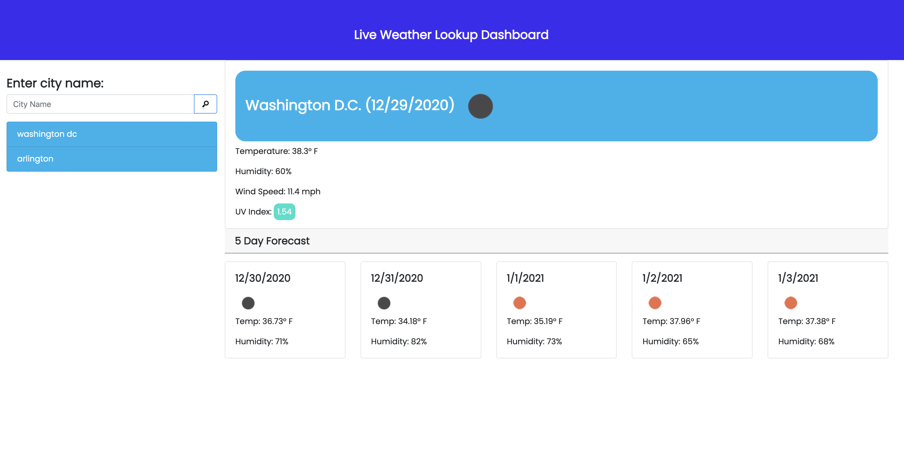

## Weather App
```
This is an web application that allows the user to search for the weather based on the location of the users input. It also allows the user to see the days in advance for any weather that may be inconvenient for the user. 
```

## TECHNOLOGIES USED

```
HTML
CSS
JAVASCRIPT
```
## SCREENSHOT OF APPLICATION
;


## Deployed Application Link URL

https://elhiloyasin.github.io/Weather-app/
